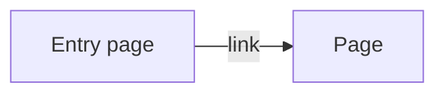

# Plan: <issue-number> — <title>

- **Issue:** 1n1-apps/1n1-studio#<n> (`<E2-F1>`, parent epic 1n1-apps/1n1-studio#<n>)
- **Product revision:** <n> (`1n1-studio/docs/product/brief.md`)
- **Amendments in force:** <path(s) in `1n1-studio`, or `none — checked 1n1-studio/docs/product/amendments as of <date>`>
- **ADRs:** <`ADR NNNN` governing this area; and the ADR this ticket will add, or why none>
- **Browser review:** `none` | <what the owner needs to see in a browser, and why no automated check can show it>
- **Approved visuals:** <the options artifact's link, its committed path under `docs/design/`, and the
  owner's pick IDs — or `none — <no rendered output | the owner waived it on <date>>`>

## What this ticket delivers

<Two or three sentences. The visitor-observable outcome, not the implementation.>

## Acceptance-criteria inventory

Every criterion from the Issue, numbered. Reconciliation walks this list.

| # | Criterion | Approach | Slice |
| --- | --- | --- | --- |
| 1 | <verbatim or tightly paraphrased> | <how it will be satisfied> | S1 |
| 2 |  |  | S1 |

## Investigation

What was actually read and run before planning — not a promise to look later.

- **Existing code:** <the templates, stylesheets, scripts and content files this touches, with paths.
  Name the existing component or token being reused; if a new one is being introduced, say why the
  existing one does not fit.>
- **Prior art in this repo:** <the closest existing page and what it does differently>
- **Constraints found:** <visual-system tokens, URL scheme, ADR rules, hosting limits that shape the approach>
- **Open questions:** <must be empty, or answered by the owner, before implementation starts>

## Product design choices

The decisions the owner should argue with *now*, while they are free to change. One block each.

### <Decision>

- **Chosen:** <what the visitor will experience>
- **Alternatives:** <what else was considered, and what each would have felt like>
- **Why this one:** <the reasoning — visitor outcome, consistency with existing pages, cost, amendment>
- **Reversible?** <cheap to change later, or does it set a URL, a content structure, or a convention?>

## Pages

Per page and per state. Delete if the ticket changes no rendered page.

### <Page name> — `/<path>`

| State | What the visitor sees | How they got here |
| --- | --- | --- |
| default |  |  |
| empty |  |  |
| error (404, missing asset) |  |  |

- **Viewports:** <what changes between phone width and desktop width>
- **Colour schemes:** <light and dark, and anything that differs>
- **Interactions:** <links, anchors, keyboard navigation, and what each does>
- **Accessibility:** <landmarks, headings order, link text, contrast, focus order>

## Content and data flow

<What content is authored where, how it becomes a page, and what is generated. Keep content,
structure and presentation apart per `docs/design/web-conventions.md`.>

- **Rules and invariants:** <what must always be true — a stable URL, a required element>
- **Edge cases:** <missing content, a long title, a new app with no store link yet>
- **Failure behaviour:** <what a broken link check or a failed build reports>

## Slices

Shippable order. Each slice is independently testable and ends green.

| Slice | Change | Tests and checks | Criteria |
| --- | --- | --- | --- |
| S1 | <smallest useful behaviour> | <unit / build / links / a11y> | 1, 2 |

## Evidence plan

- **Tests:** <what proves each slice>
- **Checks:** <build, links, accessibility on the built output>
- **Browser review:** <what the owner must see, or `none — <reason>`>
- **Screenshots:** exact list, captured from the built output, saved to `docs/evidence/issue-<n>-<slug>/`:
  - `01-<page>-phone-light.png` — <what it proves>
  - `02-<page>-desktop-dark.png` — <what it proves>
- **Not captured:** <states deliberately not evidenced, and why>

## Risks

| Risk | Blast radius | Mitigation |
| --- | --- | --- |
|  |  |  |

## Out of scope

Each entry needs a reason and a destination. "Deferred to a later ticket" is not a reason — if the
Issue asks for it, it is in scope.

- <thing> — <why it is genuinely outside this Issue's acceptance criteria> → <existing Issue, or
  `no work needed`>

---

## Delivered

<Added at reconciliation, before the PR opens. Do not pre-fill.>

| # | Criterion | Status | Where |
| --- | --- | --- | --- |
| 1 |  | ✅ | <commit / file> |
| 2 |  | ⚠️ deviation | <what changed from the plan and why> |

- **Plan deviations:** <what the implementation did differently, and why it was right>
- **ADR reconciled:** <the ADR now matches what was built — amended in <commit>, status `accepted`>
- **Evidence captured:** <the screenshot list above, all present at the stated paths>
- **Nothing deferred:** <confirm every criterion is met, or name the owner decision that changed scope>
